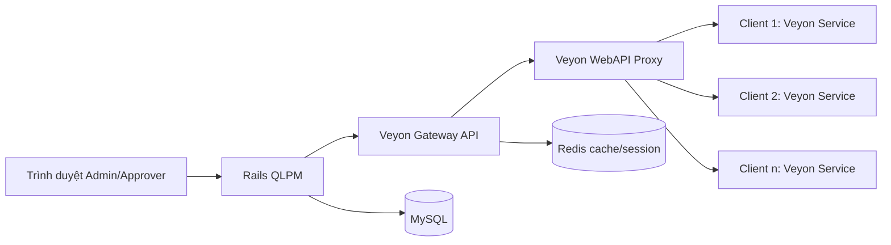

# Kiến trúc tích hợp Veyon cho QLPM

## 1) Mục tiêu
- Tích hợp giám sát và điều khiển máy trạm vào hệ thống QLPM hiện tại.
- Dùng mô hình API server trung gian để không để browser hoặc Rails chạm trực tiếp vào Veyon Service.
- Tách rõ control-plane và image-plane để giảm bottleneck khi có nhiều máy.
- Giữ RBAC hiện tại: `admin`, `approver`, `user` (`teacher/student`).

## 2) Ràng buộc kỹ thuật từ Veyon
- Veyon WebAPI hỗ trợ hai chế độ: `Local` (WebAPI trên từng client, host là `localhost`) và `Proxy` (WebAPI trên server trung gian, server đó kết nối tới host đích).
- WebAPI có vòng đời kết nối theo `connection-uid` và timeout mặc định: `lifetime=3h`, `idle=60s`, `authentication timeout=15s`.
- Mặc định WebAPI tắt, port mặc định `11080`.
- Port Veyon Server mặc định `11100` (demo server `11400`).

## 3) Kiến trúc đích (đề xuất triển khai thực tế)

## 4) Vai trò từng thành phần
- `Rails QLPM`:
  - Xác thực người dùng và RBAC.
  - Quản lý nghiệp vụ mượn/trả.
  - Gửi lệnh điều khiển Veyon qua Gateway.
  - Ghi nhật ký/audit.
- `Veyon Gateway API` (service mới):
  - Quản lý `connection-uid` theo host.
  - Chuẩn hóa retry/timeout/circuit breaker khi gọi WebAPI.
  - Ẩn thông tin bí mật (private key, tài khoản hệ thống) khỏi Rails/UI.
  - Trả ảnh framebuffer đã nén đúng profile cho UI.
- `Veyon WebAPI Proxy`:
  - Điểm vào duy nhất cho điều khiển máy trạm.
  - Kết nối tới host đích và thực thi feature API.
- `Client máy trạm`:
  - Chạy Veyon Service (bắt buộc).
  - Lắng nghe port Veyon Service, mặc định `11100`.
  - Không cần web server tự viết riêng trên từng máy nếu dùng Proxy mode.

## 5) Luồng nghiệp vụ chính

### 5.1 Luồng duyệt phiếu + khóa máy
1. Approver mở danh sách phiếu chờ duyệt trên QLPM.
2. Chọn thiết bị/phòng tương ứng và bấm thao tác điều khiển.
3. Rails gọi Gateway: mở/kế thừa connection tới host.
4. Gateway gọi WebAPI `/api/v1/authentication/<HOST>` để lấy `connection-uid`.
5. Gateway gọi `/api/v1/feature/<FEATURE-UID>` để thực thi hành động (lock, message, open website, ...).
6. Rails ghi `audit log` gồm: ai thao tác, host nào, lệnh nào, kết quả gì.

### 5.2 Luồng xem thumbnail màn hình
1. UI poll mỗi 1-3 giây (hoặc SSE) danh sách ảnh thu nhỏ.
2. Rails yêu cầu Gateway lấy framebuffer theo kích thước chuẩn (`width/height`, JPEG quality).
3. Gateway trả về ảnh đã nén, có cache ngắn hạn (0.5-2 giây) để giảm tải.
4. UI render lưới máy theo phòng/lớp.

## 6) API contract giữa Rails và Gateway

Xem chi tiết tại file: `docs/veyon/gateway-openapi.yaml`.

Các endpoint cốt lõi:
- `POST /v1/connections/open`
- `DELETE /v1/connections/{connection_uid}`
- `GET /v1/hosts/{host}/framebuffer`
- `POST /v1/hosts/{host}/features/{feature_key}`
- `GET /v1/hosts/{host}/user`
- `GET /v1/hosts/{host}/session`

## 7) Mapping quyền (RBAC) trong QLPM
- `admin`:
  - Toàn quyền xem/điều khiển.
  - Quản lý mapping host, policy, key.
- `approver`:
  - Duyệt/từ chối phiếu.
  - Chỉ được dùng tập feature cho phép (ví dụ: lock, text message, open website, start app).
  - Không được thay đổi cấu hình gateway/key.
- `user (teacher/student)`:
  - Không điều khiển máy.
  - Chỉ tạo phiếu và theo dõi phiếu của chính mình.

## 8) Mô hình dữ liệu cần bổ sung (đề xuất)

### 8.1 Bảng `veyon_hosts`
- `id`
- `asset_id` (FK assets)
- `host`
- `service_port` (default 11100): port Veyon Service trên Windows client, không phải port WebAPI Proxy
- `enabled` (bool)
- `last_seen_at`
- `metadata_json`

### 8.2 Bảng `veyon_actions`
- `id`
- `user_id`
- `borrow_id` (nullable)
- `asset_id`
- `host`
- `feature_key`
- `request_payload_json`
- `response_payload_json`
- `status` (`queued/sent/success/failed`)
- `error_code`
- `error_message`
- `created_at`

### 8.3 Bảng `veyon_snapshots` (tùy chọn)
- `id`
- `asset_id`
- `captured_at`
- `image_path` hoặc `blob_ref`
- `width`
- `height`
- `format`

## 9) Bảo mật
- Không lưu private key Veyon trong DB dạng plain text.
- Dùng secret manager hoặc env injection cho Gateway.
- Rails -> Gateway dùng `X-API-Key` nội bộ + allowlist source IP.
- Gateway -> WebAPI bật HTTPS/TLS 1.3 khi có thể.
- Chặn feature nguy hiểm theo policy (reboot/powerdown) nếu chưa cần.
- Mọi thao tác điều khiển đều bắt buộc audit log.

## 10) Hiệu năng và bottleneck
- Không stream full frame qua Rails nếu số lượng máy lớn.
- Giới hạn ảnh thumbnail:
  - width ~ 320-480
  - JPEG quality ~ 50-65
  - refresh 1-3 giây
- Cache ngắn tại Gateway theo host để gom request đồng thời.
- Dùng hàng đợi cho lệnh điều khiển hàng loạt (message/lock all).
- Áp dụng giới hạn kết nối song song theo phòng/lớp.

## 11) Triển khai Docker cho môi trường demo
- `mysql`: dữ liệu nghiệp vụ.
- `app` (Rails): UI + nghiệp vụ.
- `redis`: cache + queue (nếu bật worker).
- `veyon-gateway`: API trung gian.
- `adminer` (tùy chọn).

Ghi chú:
- WebAPI Proxy thuộc phía hạ tầng Veyon, có thể đặt trên máy gateway riêng trong LAN.
- Với demo nhỏ: có thể chạy Gateway và Rails cùng host, nhưng vẫn giữ tách process.

## 12) Kế hoạch triển khai 3 phase

### Phase A (2-4 ngày) - Control foundation
- Tạo service `veyon-gateway` với các endpoint open/auth/feature/framebuffer.
- Thêm env cấu hình vào QLPM.
- Thêm bảng `veyon_hosts`, `veyon_actions`.

### Phase B (3-5 ngày) - UI + RBAC
- Tích hợp trang approver với danh sách host theo phiếu mượn.
- Nút thao tác nhanh: lock, message, open website.
- Luật quyền theo role.

### Phase C (3-5 ngày) - Scale + reliability
- Cache framebuffer ngắn hạn.
- Queue cho lệnh hàng loạt.
- Dashboard sức khỏe host (`online/offline`, latency, error rate).

## 13) Tiêu chí hoàn thành
- Approver điều khiển được đúng máy theo phiếu mượn.
- Teacher/student không truy cập được chức năng điều khiển.
- Toàn bộ lệnh có audit log, truy vết được.
- Khi một host lỗi, các host khác vẫn hoạt động (không fail toàn cục).
- Thời gian tải 30 thumbnail đầu < 3 giây trong LAN demo.
